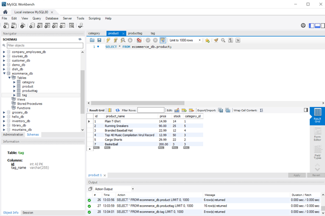
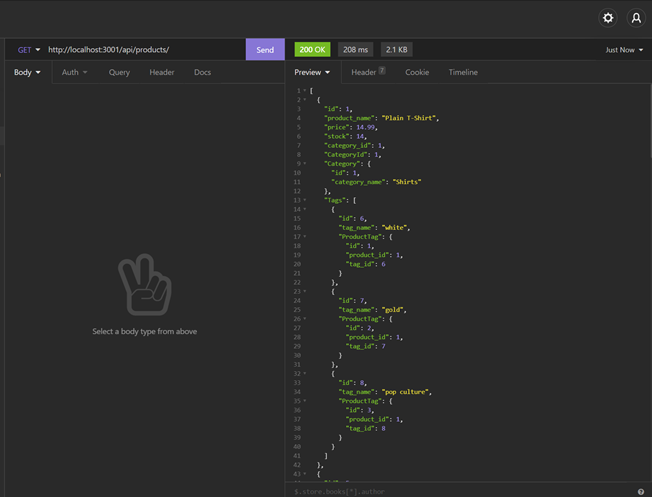

## E-Commerce Back End


## Table of Contents
* [GitHub](#GitHub)
* [Description](#description)
* [Installation Instructions](#installation-instructions)
* [Usage Instructions](#usage-instructions)
* [Contribution Guidelines](#contribution-guidelines)
* [Test](#test)
* [Questions](#questions)
* [License](#license)

## GitHub
My GitHub username is B3nj1e. 
Please click [here](https://github.com/B3nj1e) to access my GitHub profile and the associated repository [here](https://github.com/B3nj1e/E-Commerce-Back-End).

## Description
An E-commerce back end to create a database, with tables to organise inventory (categories, products, tags and product tags), and API routes that perform RESTful CRUD operations and allow the interaction with the database to CREATE, READ, UPDATE and DELETE stored data. 

User story:
```md
AS A manager at an internet retail company
I WANT a back end for my e-commerce website that uses the latest technologies
SO THAT my company can compete with other e-commerce companies
```
Acceptance Criteria:

```md
GIVEN a functional Express.js API
WHEN I add my database name, MySQL username, and MySQL password to an environment variable file
THEN I am able to connect to a database using Sequelize
WHEN I enter schema and seed commands
THEN a development database is created and is seeded with test data
WHEN I enter the command to invoke the application
THEN my server is started and the Sequelize models are synced to the MySQL database
WHEN I open API GET routes in Insomnia Core for categories, products, or tags
THEN the data for each of these routes is displayed in a formatted JSON
WHEN I test API POST, PUT, and DELETE routes in Insomnia Core
THEN I am able to successfully create, update, and delete data in my database
```


## Installation Instructions
To use the application, please download all associated files off the [GitHub repository](https://github.com/B3nj1e/E-Commerce-Back-End). Ensure node.js is installed. In the terminal run ``npm i`` to install the dependencies, including sequelize, express, dotenv and mysql2. Before proceeding to run the application, ensure to update your user data in the ``.env.EXAMPLE`` file and then rename the file ``.env``. Once these steps have been carried out, create the database by opening the ``db`` file in the integrate terminal, log into your mysql and run ``source schema.sql``. Run ``npm run watch``, this will start the sever with the nodemon package(if you have this package installed). If you have MySQL Work Bench installed you will be able to see data in the tables under "ecommerce_db" and if you have insomina installed you will get able to run the GET, PUT, POST and DELETE HTTP requests to interact with stored data. Use localhost at PORT 3001 to access the routes. Use the POST route to enter you own data.  

## Usage Instructions
Please click [here](https://drive.google.com/file/d/1ZSPAOSrDKITTHebAOiB9RbGiXmkbEsEy/view?usp=sharing) to view a video tutorial on how to use this application. 

## Contribution Guidelines
If you think you can improve this application, please feel free to make contributions. I will review these changes on GitHub prior to merging them to the main branch.

## Test
To quickly test the application, follow the installation instructions above. To seed the database with some default data, navigate back to the parent folder and run ``npm run seed``, followed by ``npm run watch``. Navigate to MySQL Workbench, if the seeding was successful you should have an "ecommerce_db" database with 4 tables; categories, products, tags and product tags, with each table having it's own stored data. To test the routes, open Insomnia and use localhost with PORT 3001. Run the GET, PUT, POST and DELETE HTTP requests to interact with stored data.


Example of seeded database using MySQL WorkBench, populated product table.


Example of a successful HTTP GET request using Insomnia, obtaining product data.


## Questions
If you have any questions or would like to report an issue with the application, please contact me vie my email at blankemail@email.com(left blank for privacy concerns). Alternative contact me via my [GitHub account](https://github.com/B3nj1e). 

## License
If you require more information concerning the license, please click [here](https://choosealicense.com/licenses/).

---------------------

MIT License

Copyright (c) 2021 B3nj1e

Permission is hereby granted, free of charge, to any person obtaining a copy
of this software and associated documentation files (the "Software"), to deal
in the Software without restriction, including without limitation the rights
to use, copy, modify, merge, publish, distribute, sublicense, and/or sell
copies of the Software, and to permit persons to whom the Software is
furnished to do so, subject to the following conditions:

The above copyright notice and this permission notice shall be included in all
copies or substantial portions of the Software.

THE SOFTWARE IS PROVIDED "AS IS", WITHOUT WARRANTY OF ANY KIND, EXPRESS OR
IMPLIED, INCLUDING BUT NOT LIMITED TO THE WARRANTIES OF MERCHANTABILITY,
FITNESS FOR A PARTICULAR PURPOSE AND NONINFRINGEMENT. IN NO EVENT SHALL THE
AUTHORS OR COPYRIGHT HOLDERS BE LIABLE FOR ANY CLAIM, DAMAGES OR OTHER
LIABILITY, WHETHER IN AN ACTION OF CONTRACT, TORT OR OTHERWISE, ARISING FROM,
OUT OF OR IN CONNECTION WITH THE SOFTWARE OR THE USE OR OTHER DEALINGS IN THE
SOFTWARE.